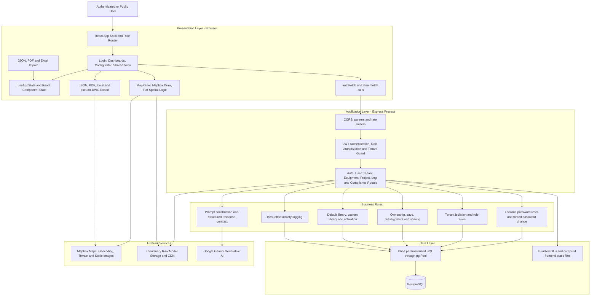
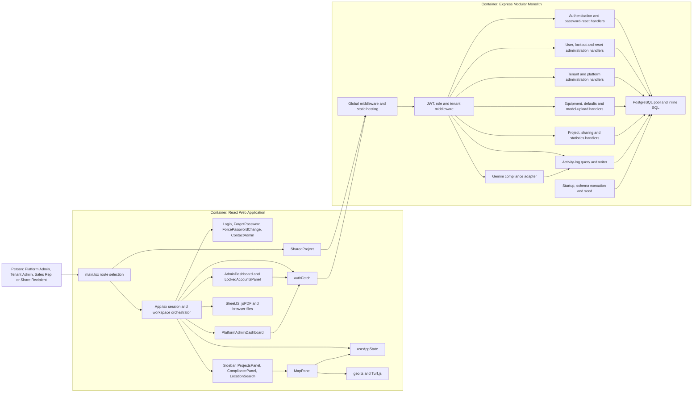
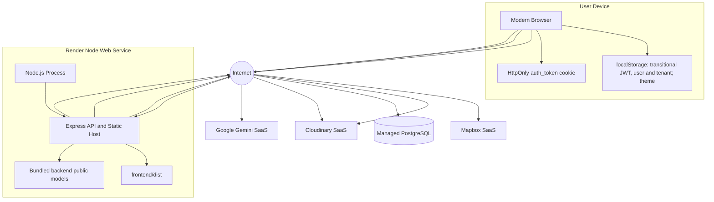
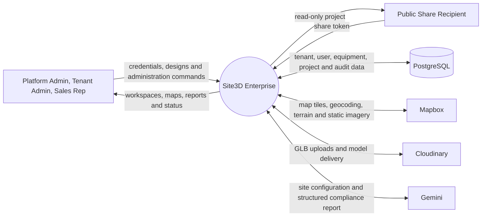
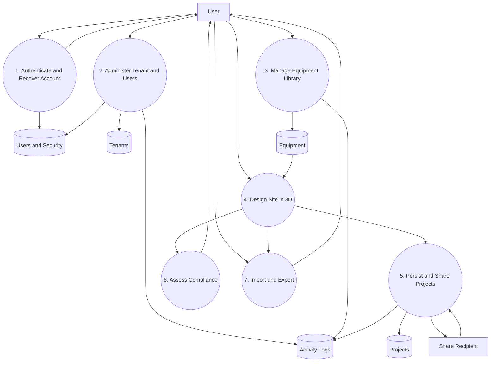
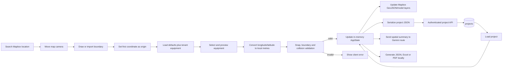
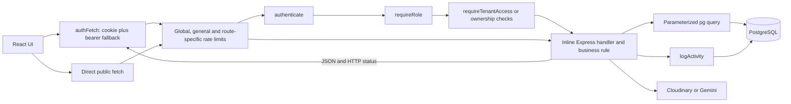
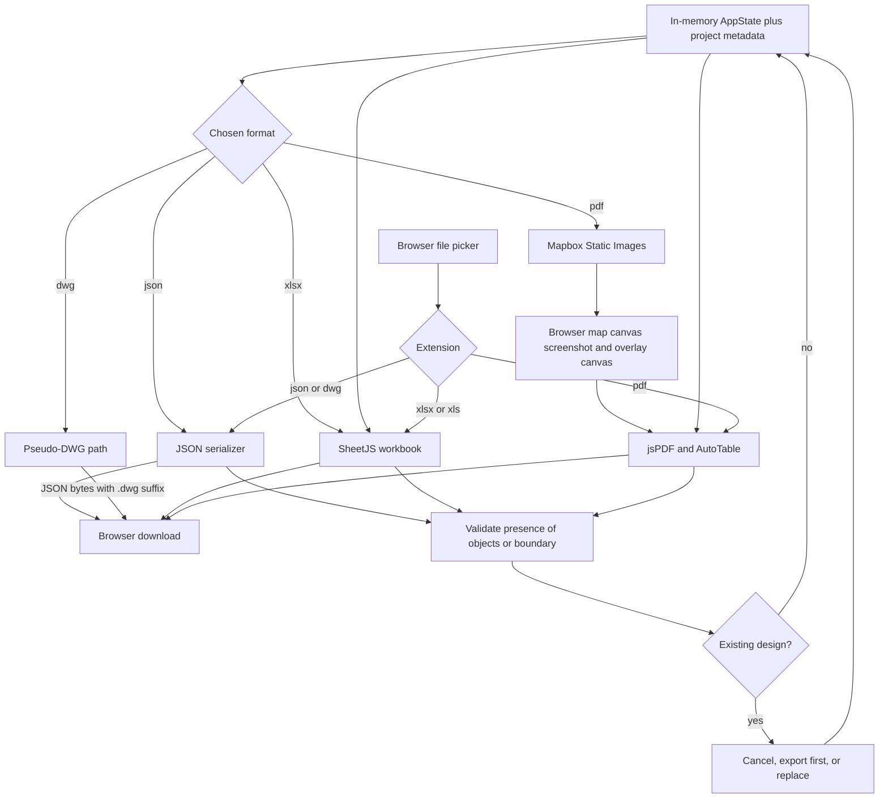

# Site3D Enterprise Architecture Dossier

**Review baseline:** source tree inspected on 2026-06-30  
**System:** Calibit 3D Site Configurator  
**Audience:** CTO, engineering management, architecture review, client technical review  
**Evidence rule:** statements below describe executable source. Requested capabilities not found in source are marked **Not implemented** or **Not verified**.

## 1. Executive architecture assessment

Site3D Enterprise is a browser-centric, multi-tenant site-planning application. React owns interactive 3D design, local spatial state, import/export, and role-specific workspaces. A single Express process owns authentication, authorization, PostgreSQL access, project/equipment/tenant administration, Cloudinary upload mediation, and Gemini compliance calls. Mapbox is called directly by the browser for maps, geocoding, terrain, and static-map imagery.

The deployed topology is a modular monolith, not a service-oriented system. `backend/server.ts` contains middleware, route handlers, business rules, SQL, integration adapters, schema bootstrap, seeding, static-file hosting, and process startup. The frontend is componentized, but `App.tsx`, `AdminDashboard.tsx`, `MapPanel.tsx`, and `PlatformAdminDashboard.tsx` are large orchestration modules.

### 1.1 Confirmed technology

| Concern | Implementation |
|---|---|
| Presentation | React 19, TypeScript, Vite, Tailwind CSS, Motion, Lucide |
| Map and spatial processing | Mapbox GL JS, Mapbox Draw, Turf.js |
| Application API | Express 4, JSON/URL-encoded bodies, CORS, cookies |
| Authentication | bcrypt password hashes; signed JWT with 8-hour expiry; HttpOnly cookie plus transitional local-storage bearer token |
| Authorization | `authenticate`, `requireRole`, `requireTenantAccess`, plus route-local ownership checks |
| Persistence | PostgreSQL through `pg.Pool`; SQL issued directly from route handlers |
| AI compliance | Google Gemini `gemini-3-flash-preview` through `@google/generative-ai` |
| Model storage | Cloudinary raw-resource upload through Multer/CloudinaryStorage; bundled GLB fallback |
| Document export | SheetJS (`xlsx`), jsPDF, jsPDF-AutoTable, browser Blob API |
| Hosting | Render web service; frontend compiled and served by Express in production |
| Test automation | Playwright, currently focused on sales-representative password reset |

### 1.2 Requested integrations that are not present

| Requested capability | Source finding |
|---|---|
| Google Maps | **Not implemented.** The application uses Mapbox APIs and Mapbox GL JS. |
| Autodesk Platform Services (APS) translation | **Not implemented.** No APS package, credentials, route, or client call exists. |
| Email service / notifications | **Not implemented.** Platform-admin OTPs are returned to the client and written to server logs. No SMTP/API transport exists. |
| Native DWG generation | **Not implemented.** JSON is serialized with a `.dwg` filename; it is not a DWG binary. |
| Token refresh | **Not implemented.** JWT expires after eight hours; the client logs out after recognized 401/403 token errors. |
| Manual account lock API | **Not implemented.** Locking occurs automatically after three failed password checks. |
| Tenant deletion | **Not implemented.** Tenant list/create/update exist; no delete route exists. |
| Area calculation | **Not implemented as a user feature.** Turf is used for distance, containment, and collision, not exposed polygon area. |

## 2. High-level architecture



## 3. C4-style container and component view



### 3.1 Component responsibilities and interfaces

| Component | Provides | Requires |
|---|---|---|
| `App` | Role routing, session restoration, configurator orchestration, project save/load, import/export | `useAppState`, API client, browser storage/files, child UIs |
| `MapPanel` | Map rendering, boundary drawing, model/box layers, placement preview, collision safe zones, dragging, measuring | App state callbacks, Mapbox, Turf, GLB URLs |
| `Sidebar` | Equipment library, placement selection, selected-object edits, settings, export/import actions, profile edit | App state/actions, user/tenant API |
| `AdminDashboard` | Tenant overview, equipment CRUD, sales-team administration, project analytics, logs, reset approvals, profile | Tenant-scoped APIs and client-side thumbnail preparation |
| `PlatformAdminDashboard` | Cross-tenant overview, tenant create/update, global users, platform logs, tenant-admin reset approvals, profile | Platform-admin APIs |
| `ProjectsPanel` | Project details, open/delete/share and clipboard copy | Project APIs and App callbacks |
| `SharedProject` | Public read-only shared-project map | Public share-token API and Mapbox |
| `authFetch` | Credentialed requests, bearer fallback, token-error logout | `fetch`, cookie, local storage, navigation |
| Express handlers | REST/JSON application contract | Security middleware, PostgreSQL, Cloudinary, Gemini |
| `logActivity` | Best-effort audit insertion | `activity_logs`; failures are logged but do not fail the business transaction |

## 4. Module dependency diagram

```mermaid
flowchart TB
  main[frontend/src/main.tsx] --> Theme[ThemeContext]
  main --> App[App.tsx]
  main --> Shared[SharedProject.tsx]
  App --> State[useAppState.ts]
  App --> Types[backend/types.ts]
  App --> Geo[utils/geo.ts]
  App --> Api[utils/api.ts]
  App --> AuthComponents[Login, ForgotPassword, ForcePasswordChange, ContactAdmin]
  App --> Admin[AdminDashboard]
  App --> Platform[PlatformAdminDashboard]
  App --> Config[Sidebar, MapPanel, LocationSearch, ProjectsPanel, CompliancePanel, Modal]
  Admin --> Api
  Platform --> Api
  Config --> Api
  Config --> Types
  Config --> Geo
  CompliancePanel[CompliancePanel] --> ComplianceService[services/complianceService.ts]
  ComplianceService --> ComplianceAPI[/api/compliance/check]
  Server[backend/server.ts] --> Types
  Server --> Schema[backend/schema.sql]
  UploadScript[backend/scripts/upload-default-models.ts] --> Assets[backend/public/models]
  Server --> Assets
  Server --> PostgreSQL[(PostgreSQL)]
  Server --> Gemini[Gemini]
  Server --> Cloudinary[Cloudinary]
  Config --> Mapbox[Mapbox]
```

## 5. Deployment diagram



Render builds the Vite bundle, compiles TypeScript under `backend`, and starts `backend/dist/server.js`. Express searches for `frontend/dist`, serves it if present, and applies an SPA catch-all to extensionless paths. The process binds `0.0.0.0:$PORT`. There is no worker, queue, cache, object-store abstraction, or separate API deployment.

## 6. Data-flow diagrams

### 6.1 Level 0 - system context



### 6.2 Level 1 - primary processes



### 6.3 Level 2 - configurator and project lifecycle



## 7. Authentication and authorization architecture

```mermaid
sequenceDiagram
  autonumber
  actor User
  participant Login as React Login
  participant API as Express Login Route
  participant Guard as Rate Limiter and Auth Rules
  participant DB as PostgreSQL
  participant Audit as Activity Logger

  User->>Login: Submit email and password
  Login->>API: POST /api/auth/login
  API->>Guard: Apply IP login limit
  API->>DB: SELECT user by email
  alt user absent
    API-->>Login: 401 Invalid credentials
  else locked account exists
    API->>DB: Read locked_accounts
    API-->>Login: 423 accountLocked
  else inactive or archived sales representative
    API-->>Login: 403 accountDeactivated
  else password matches bcrypt hash
    API->>DB: Clear login_attempts and load tenant
    API->>API: Sign 8-hour JWT
    API-->>Login: Set HttpOnly cookie and return user, tenant and transitional token
    API->>Audit: Insert LOGIN asynchronously before handler completion
    Login->>Login: Cache token, user and tenant; load projects and equipment
  else password does not match
    API->>DB: Increment login_attempts
    alt third failure
      API->>DB: Upsert locked_accounts and clear attempts
      API->>Audit: Insert LOGIN_FAILED lock event
      API-->>Login: 423 locked
    else fewer than three failures
      API->>Audit: Insert LOGIN_FAILED count
      API-->>Login: 401 with failedAttempts
    end
  end
```

Every protected call accepts the cookie first and bearer token second. `jwt.verify` attaches `{userId, role, tenantId, userName}` to the request. `requireRole` checks explicit role membership. `requireTenantAccess` compares a route/query tenant identifier with the JWT tenant unless the caller is platform admin. Several project routes additionally enforce project owner or tenant after reading the record.

Security caveats:

- The JWT is correctly placed in an HttpOnly cookie, but is also returned in JSON and persisted in `localStorage`, preserving an XSS-accessible credential path.
- Logout clears the cookie but does not revoke an issued JWT; no token store or denylist exists.
- OTP values are returned by the forgot-password API and logged to stdout; this is suitable only as a development placeholder.
- Rate limits are IP-based. Global and general limiters both apply, while `uploadLimiter` is declared but not attached to the upload route.
- No CSRF token mechanism exists. `SameSite=strict` in production reduces but does not replace deliberate CSRF design.

## 8. Database relationship model

```mermaid
erDiagram
  TENANTS ||--o{ USERS : contains
  TENANTS ||--o{ EQUIPMENT : owns
  TENANTS ||--o{ PROJECTS : owns
  TENANTS ||--o{ TENANT_DISABLED_DEFAULTS : configures
  USERS ||--o{ PROJECTS : authors
  USERS ||--o{ PASSWORD_RESET_REQUESTS : requests
  USERS ||--o{ PLATFORM_ADMIN_OTPS : receives
  USERS ||--o| LOGIN_ATTEMPTS : accumulates
  USERS ||--o| LOCKED_ACCOUNTS : may_have
  USERS ||--o{ ACTIVITY_LOGS : performs

  TENANTS {
    text id PK
    text name
    text logo_url
    text primary_color
    text subscription_tier
    timestamptz created_at
  }
  USERS {
    text id PK
    text tenant_id FK
    text email UK
    text password_hash
    text role CHECK
    text name
    text phone
    integer force_password_change
    boolean is_active
    text status
  }
  EQUIPMENT {
    text id PK
    text tenant_id FK
    text name
    text category
    real width
    real depth
    real height
    text color
    text model_url
    boolean animations_enabled
    text image_url
    boolean is_active
  }
  PROJECTS {
    text id PK
    text tenant_id FK
    text user_id FK
    text name
    text data
    timestamptz created_at
    text client_name "runtime only; missing from schema.sql"
    timestamptz updated_at "runtime only; missing from schema.sql"
    text share_token "runtime only; missing from schema.sql"
  }
  PASSWORD_RESET_REQUESTS {
    text id PK
    text user_id FK
    text email
    text status
    timestamptz created_at
  }
  ACTIVITY_LOGS {
    text id PK
    text tenant_id
    text user_id FK
    text user_name
    text action
    text entity_type
    text entity_name
    text details
    timestamptz created_at
  }
  TENANT_DISABLED_DEFAULTS {
    text tenant_id PK_FK
    text equipment_id PK
  }
  PLATFORM_ADMIN_OTPS {
    text id PK
    text user_id FK
    text email
    text otp
    text expires_at
    boolean used
    timestamptz created_at
  }
  LOGIN_ATTEMPTS {
    text id PK
    text user_id FK
    text email
    integer failed_count
    timestamptz last_attempt_at
    boolean is_locked
    timestamptz locked_at
    text locked_by_role
    timestamptz created_at
  }
  LOCKED_ACCOUNTS {
    text id PK
    text user_id UK_FK
    text email
    text user_role
    timestamptz locked_at
    text reason
    text can_unlock_by_roles
    timestamptz created_at
  }
```

### 8.1 Keys, constraints, indexes and deletion behavior

| Object | Constraint / behavior |
|---|---|
| `users.email` | Global unique constraint |
| `users.role` | Check constraint: `platform_admin`, `tenant_admin`, `sales_rep` |
| `users(phone, tenant_id)` | Partial unique index when phone is non-null/non-empty |
| `tenant_disabled_defaults` | Composite primary key prevents duplicate disabled defaults |
| `locked_accounts.user_id` | Unique; one current lock row per user |
| `projects.user_id` | Schema migration recreates FK with `ON DELETE SET NULL` |
| Other tenant/user foreign keys | No explicit cascade; PostgreSQL default is restrict/no action |
| Search/sort columns | No source-declared indexes for tenant IDs, project owner, timestamps, share token, reset status, or logs |

### 8.2 Schema-to-runtime discrepancies

1. Project create/list/update/share SQL references `client_name`, `updated_at`, and `share_token`, but `schema.sql` never creates them. A database created only from this file will fail those routes.
2. `activity_logs.user_id` is `NOT NULL` and has no declared FK, while user deletion attempts to set it to `NULL`; that update is swallowed and historical text remains, but referential intent is inconsistent.
3. `expires_at` in OTPs is text rather than `TIMESTAMPTZ`; application code parses it with JavaScript `Date`.
4. `ensureDatabaseSchema` splits SQL text heuristically on semicolon/newline. It is not a versioned migration system and has no transaction around the full bootstrap.
5. Tenant creation manually deletes the tenant if admin creation fails rather than using a database transaction.

## 9. API interaction architecture



### 9.1 Complete active API catalog

Legend: `A` authenticated, `R` role-restricted, `T` tenant/ownership restricted, `P` public.

| Method and path | Access | Responsibility |
|---|---|---|
| `GET /api/health` | P | Liveness text response |
| `POST /api/auth/login` | P, login limit | Validate credentials, lockout, JWT/cookie, tenant, audit |
| `POST /api/auth/logout` | P | Clear auth cookie |
| `POST /api/auth/forgot-password` | P, reset limit | Create delegated reset request or platform OTP |
| `POST /api/auth/platform-reset-verify` | P, OTP limit | Verify OTP and set platform-admin password |
| `GET /api/locked-accounts` | A,R | List tenant-visible or global locks |
| `POST /api/locked-accounts/:userId/unlock` | A,R,T-local | Enforce unlock hierarchy and delete lock |
| `GET /api/lockable-accounts` | A,R | List only locks the caller role may resolve |
| `GET /api/tenant/:id/users` | A,R,T | List tenant users without hashes |
| `POST /api/tenant/:id/users` | A,R,T | Create tenant user; phone and sales-rep-limit validation |
| `PUT /api/users/:id` | A, self/admin | Update profile and optionally password |
| `DELETE /api/users/:id` | A,R | Delete non-admin user after project/user reference cleanup |
| `PATCH /api/users/:id/toggle-active` | A,R | Activate/deactivate sales representative |
| `GET /api/users/:id/projects` | A,R | List projects assigned to a representative |
| `PATCH /api/projects/:projectId/reassign` | A,R | Reassign one project and audit |
| `PATCH /api/users/:id/reassign-all-projects` | A,R | Bulk reassign projects with per-project audit |
| `PATCH /api/users/:id/archive` | A,R | Archive sales representative only when no projects remain |
| `GET /api/tenant/:tenantId/equipment/stats` | A,T | Combine custom and default active/inactive counts |
| `GET /api/tenant/:id/equipment` | A,T | List custom equipment |
| `POST /api/tenant/:id/equipment` | A,R,T | Validate and create custom equipment |
| `PUT /api/tenant/:tenantId/equipment/:id` | A,R,T | Update tenant equipment |
| `DELETE /api/tenant/:tenantId/equipment/:id` | A,R,T | Delete tenant equipment |
| `PATCH /api/tenant/:tenantId/equipment/:id/toggle` | A,R,T | Set custom equipment active flag |
| `POST /api/upload/model` | A | Stream one multipart GLB/GLTF, max 25 MiB, to Cloudinary |
| `GET /api/tenant/:tenantId/disabled-defaults` | A,T | List disabled built-in equipment IDs |
| `POST /api/tenant/:tenantId/disabled-defaults/:equipmentId` | A,R,T | Toggle default equipment availability |
| `GET /api/admin/tenants` | A, platform R | List tenants with project count |
| `POST /api/admin/tenants` | A, platform R | Create tenant and initial tenant administrator |
| `PUT /api/admin/tenants/:id` | A, platform R | Update tenant properties |
| `GET /api/admin/stats` | A, platform R | Count tenants, non-archived users and projects |
| `GET /api/admin/users` | A, platform R | Cross-tenant user list |
| `POST /api/admin/users` | A, platform R | Create arbitrary user |
| `GET /api/projects` | A,T | List role-visible tenant projects |
| `GET /api/projects/:id` | A,T/owner | Load complete project |
| `POST /api/projects` | A | Create project and audit |
| `PUT /api/projects/:id` | A, owner for sales R | Update project data/name/client and audit |
| `DELETE /api/projects/:id` | A,T/owner | Delete project and audit |
| `POST /api/projects/:id/share` | A, owner for sales R | Create/reuse opaque public share token |
| `GET /api/projects/shared/:token` | P | Return read-only project and equipment lookup |
| `GET /api/tenant/:tenantId/project-stats` | A,R,T | Per-sales-representative counts and last activity |
| `GET /api/tenant/:tenantId/active-projects` | A,R,T | Count projects changed in last five days |
| `GET /api/admin/reset-requests` | A,R | List caller-visible pending reset requests |
| `GET /api/admin/tenant-admin-resets` | A, platform R | List tenant-admin reset requests |
| `POST /api/admin/reset-requests/:id/resolve` | A,R | Set temporary password and force next-login change |
| `GET /api/tenant/:id/logs` | A,R,T | Paginated tenant activity logs |
| `GET /api/admin/logs` | A, platform R | Paginated platform-level activity logs |
| `POST /api/compliance/check` | A, AI limit | Send structured site prompt to Gemini and return schema-bound JSON |

## 10. Export and import architecture



Excel stores a human-readable configuration sheet plus hidden `_ProjectData` JSON split into 30,000-character chunks. Import prefers embedded raw JSON and falls back to reconstructing objects from equipment rows. PDF contains project details, a static map with drawn overlays, an equipment table, an optional live 3D capture, and base64 project JSON in metadata/hidden text. JSON is the native interchange format. DWG has no CAD encoder and must not be represented externally as interoperable DWG.

## 11. Map and spatial processing

`MapPanel` initializes Mapbox Draw and sources/layers for measurement, editable/read-only boundary, 3D buildings, equipment boxes/models, placement ghosts, safe zones, and violations. It rebuilds sources after style changes, registers GLB models by URL, and uses feature state for selection. Terrain uses Mapbox DEM with 1.2 exaggeration.

The first boundary coordinate becomes the local origin. Turf distance/destination functions translate longitude/latitude to local east/south metres and back. Placement snaps to 0.5 m, tests point containment, builds rotated equipment footprints, and rejects intersections. Movement enforces containment and collision. The visual safe-zone layer is a placement aid; Gemini performs the named compliance evaluation separately.

Boundary drawing is synchronized bidirectionally between Mapbox Draw and React state. Measurement holds at most two coordinates and displays Turf distance plus a midpoint label. Search is debounced Mapbox geocoding with five suggestions and a fly-to target.

## 12. Source inventory and architectural role

| Path | Architectural role |
|---|---|
| `backend/server.ts` | Entire API/runtime composition root, middleware, business rules, SQL, integrations and hosting |
| `backend/schema.sql` | Idempotent baseline DDL plus small in-place alterations; incomplete for current project queries |
| `backend/types.ts` | Shared domain interfaces and 12-item default equipment catalog |
| `backend/scripts/upload-default-models.ts` | One-time sequential upload of bundled default GLBs to Cloudinary |
| `backend/public/models/*` | Bundled GLB fallback and source material; includes duplicate/dated filenames |
| `backend/public/images/*` | Static equipment images |
| `frontend/src/main.tsx` | Browser entry; chooses full application or public shared view |
| `frontend/src/App.tsx` | Session/role router, configurator orchestration, spatial validation, persistence and import/export |
| `frontend/src/useAppState.ts` | In-memory site state and immutable mutations |
| `frontend/src/utils/api.ts` | Credentialed API adapter and token-expiry logout |
| `frontend/src/utils/geo.ts` | Local-metre projection, reverse projection, containment and extents |
| `frontend/src/services/complianceService.ts` | Compliance request/response adapter; local default library is empty, so built-ins may be sent as unknown |
| `frontend/src/contexts/ThemeContext.tsx` | Persistent light/dark theme context |
| `frontend/src/components/MapPanel.tsx` | Mapbox rendering, draw/edit interactions, models, collisions, measurement and terrain |
| `frontend/src/components/Sidebar.tsx` | Configurator controls, equipment selection/edit, imports/exports and profile |
| `frontend/src/components/AdminDashboard.tsx` | Tenant administration and analytics |
| `frontend/src/components/PlatformAdminDashboard.tsx` | Platform administration |
| `frontend/src/components/Login.tsx` | Login form and lock/deactivation error presentation |
| `frontend/src/components/ForgotPassword.tsx` | Delegated reset request and platform-admin OTP flow |
| `frontend/src/components/ForcePasswordChange.tsx` | Mandatory password replacement via user update API |
| `frontend/src/components/ContactAdmin.tsx` | Static recovery guidance |
| `frontend/src/components/LockedAccountsPanel.tsx` | Role-scoped lock list and unlock command |
| `frontend/src/components/LocationSearch.tsx` | Debounced Mapbox geocoding |
| `frontend/src/components/ProjectsPanel.tsx` | Project detail/open/delete/share UI |
| `frontend/src/components/SharedProject.tsx` | Public share-token loader and read-only Mapbox rendering; contains large commented prior implementations |
| `frontend/src/components/CompliancePanel.tsx` | Compliance execution and report UI |
| `frontend/src/components/Modal.tsx` | Generic dialog shell |
| `frontend/src/types.ts` | Duplicate lightweight user/project/tenant interfaces; most configurator code imports backend types directly |
| `frontend/src/index.css` | Tailwind entry and global visual styling |
| `frontend/src/assets/logo.png` | Product branding asset |
| `frontend/public/_redirects` | SPA and `/shared/*` rewrites |
| `frontend/public/models/README.txt` | Local-model authoring instructions; refers to a frontend default catalog that is not present there |
| `frontend/vite.config.ts` | React/Tailwind build, development proxies and production console stripping |
| `render.yaml` | Render build/start and required environment-variable declarations |
| `tests/password-reset-sales-rep.spec.ts` | Five browser tests for reset request and navigation; some assertions depend on environment data/UI wording |
| `playwright.config.ts` | Chromium test execution against the development server |
| `README.md`, `docs/*.md` | Existing product documentation; several SQLite and feature statements are stale relative to source |
| `package-lock.json`, `frontend/package-lock.json`, `backend/package-lock.json` | Resolved dependency graphs; generated, not executable architecture |
| `playwright-report/*`, `test-results/*` | Generated test evidence and failure context; not runtime components |
| `metadata.json`, `frontend/index.html` | Product metadata, browser root and initial route preservation |

## 13. Architecture risks and recommendations

| Priority | Finding | Architectural consequence | Recommended action |
|---|---|---|---|
| Critical | Runtime project columns are absent from `schema.sql` | Fresh deployments fail core project list/save/share flows | Introduce versioned migrations and add/verify all runtime columns and indexes |
| Critical | Project create/update routes trust body tenant/user identifiers more than the authenticated identity | A caller may attempt cross-tenant writes | Derive tenant/user from JWT except explicit, authorized admin reassignment |
| High | JWT remains in local storage and JSON response | XSS can exfiltrate a live credential | Complete cookie-only migration and add CSRF protection |
| High | Platform OTP is exposed in API response and logs | Password recovery is not a secure second channel | Add a real mail provider, store hashed OTPs, never return/log the value |
| High | Tenant creation and multi-step mutations lack transactions | Partial state and misleading audit are possible | Use `pool.connect`, `BEGIN`, `COMMIT`, `ROLLBACK` service methods |
| High | `server.ts` combines every layer | Change coupling and test cost increase | Extract routers, policies, services, repositories and integration adapters incrementally |
| High | Native DWG is advertised but absent | Client interoperability and contractual risk | Remove the label or integrate a tested CAD/DXF/DWG generation pipeline |
| Medium | Upload rate limiter is unused and MIME/extension validation is delegated to storage config | Resource abuse and malformed model risk | Attach limiter and validate extension, MIME, signature, tenant and ownership |
| Medium | Audit logging is best effort and outside transactions | Business mutation may succeed without audit evidence | Define audit durability requirements and transact where required |
| Medium | No indexes for common tenant/timestamp/share lookups | Performance degrades with tenant/project/log growth | Add indexes from observed query patterns and measure with `EXPLAIN` |
| Medium | Frontend compliance adapter has an empty default catalog | Built-in equipment can reach Gemini as unknown | Import the shared default catalog or move request shaping server-side |
| Medium | Direct browser Mapbox/Cloudinary delivery is expected but CSP is unspecified | Supply-chain and data-egress boundaries are implicit | Add CSP, allowed-origin documentation and data-classification review |
| Low | Stale docs state SQLite and outdated model instructions | Operational confusion | Make this dossier/source inventory authoritative and update onboarding docs |

## 14. Detailed sequence documentation

The requested feature-by-feature sequence set—including explicit diagrams for implemented, partial, substituted, and absent capabilities—is in [sequence-diagrams.md](./sequence-diagrams.md). Each entry records purpose, trigger, actors, preconditions, main/alternative/exception paths, postconditions, and verification status.
