# Feature Sequence Catalogue

This appendix is source-grounded. **Implemented** means an executable path exists. **Partial** means the requested name overstates the implementation. **Substituted** names the actual provider. **Absent** means the sequence deliberately records the verified gap rather than inventing a component.

## 1. Per-feature operating contract

| # | Feature / status | Purpose and trigger | Actors and preconditions | Main flow | Alternative and exception flow | Postconditions |
|---:|---|---|---|---|---|---|
| 1 | Login / Implemented | Establish an eight-hour session when credentials are submitted | User, Login, Express, PostgreSQL; account exists and server has JWT secret | Rate-limit, load user/lock, bcrypt check, clear attempts, load tenant, sign JWT, set cookie, audit | Missing/invalid credentials; inactive/archive; existing lock; DB error | Cookie and cached identity exist, or failure count/lock is updated |
| 2 | Logout / Implemented | End browser session on logout command | User, App, Express; session may exist | POST logout, clear cookie, clear local storage and React identity | Network error is swallowed; local cleanup still runs | Browser returns to login; already-issued JWT is not revoked |
| 3 | Forgot password / Implemented | Begin role-dependent recovery from email form | Public user, ForgotPassword, API, DB; rate limit permits | Look up email; platform admin gets OTP path, other roles get pending request and audit | Unknown email returns same generic success; DB error may surface | OTP or delegated reset request exists without account enumeration |
| 4 | Password reset / Implemented | Replace password through platform OTP or admin-set temporary password | Requester/admin, API, DB; valid OTP or pending request | Validate new/temp password, bcrypt hash, update user, consume/resolve record, audit | Invalid/expired OTP, short password, missing request, DB error | Password changed; delegated user is forced to change it next login |
| 5 | Change password / Implemented | Replace own/admin-managed password or mandatory temporary password | User, ForcePasswordChange/Profile, user API; authenticated | Validate client fields, PUT user, validate length, hash, clear force flag, audit | Mismatch/short password; duplicate phone; unauthorized target; DB error | New hash stored and force flag cleared |
| 6 | User registration / Absent as self-service | Clarify that public sign-up is unavailable | Public user; no registration route/component | Login page exposes sign-in/recovery only | Tenant/platform admins can create users through features 7/11 | No anonymous user is created |
| 7 | User creation / Implemented | Create a user under platform administration | Platform admin, dashboard, API, DB; authenticated platform role | POST admin user, hash password, insert row | Duplicate/DB errors are not consistently normalized | New user exists; this route does not write an activity log |
| 8 | Tenant creation / Implemented | Provision tenant and initial tenant administrator | Platform admin, dashboard, API, DB | Insert tenant, hash password, insert tenant admin, audit | Missing credentials; on insert failure delete tenant manually | Tenant/admin exist or compensating delete is attempted |
| 9 | Tenant update / Implemented | Change name, logo and subscription tier | Platform admin; tenant exists | PUT tenant, update row, audit | DB error has no route-local catch | Tenant properties change |
| 10 | Tenant delete / Absent | Record that deletion is not exposed | Platform admin; no route or UI action exists | Dashboard can list/create/update only | Direct database operations are outside application architecture | No tenant deletion occurs |
| 11 | Sales representative creation / Implemented | Add a tenant-scoped representative | Tenant/platform admin; tenant access, fewer than 10 active reps | Validate phone/password, uniqueness, hash, insert, audit | Limit reached, duplicate email/phone, invalid input, DB error | Representative exists under requested tenant |
| 12 | Sales representative update / Implemented | Edit representative name, phone, optional password/status | Admin dashboard, user API; authenticated admin | PUT user or PATCH toggle-active, validate, update, audit | Duplicate phone, invalid input, target absent, DB error | Profile/password/active state changes |
| 13 | Sales representative delete / Implemented | Permanently remove a non-admin user | Tenant/platform admin; target is non-admin | Null project owner and optional references, delete user, audit | Admin target forbidden; swallowed cleanup errors; DB failure | User removed; projects retained unassigned |
| 14 | Equipment CRUD / Implemented | Maintain tenant custom equipment | Tenant/platform admin; tenant access | List/create/update/delete using parameterized SQL and audit mutations | Invalid create dimensions/name; DB errors; update/delete do not check affected count | Tenant library changes |
| 15 | Equipment search / Implemented client-side | Find equipment by name/category as query changes | Admin dashboard; equipment already loaded | Filter default/custom arrays in React and render matches | Empty query shows all; no match shows empty state | No server/data mutation |
| 16 | Equipment filter / Implemented client-side | Separate active/inactive/default/custom views | Dashboard/Sidebar; library and disabled IDs loaded | Filter by `isActive`, disabled defaults, category/search context | Stale fetch leaves prior state; sales reps never receive inactive custom items in App mapping | Visible library reflects local filters |
| 17 | Upload GLB model / Implemented | Attach model file to equipment workflow | Admin, browser, upload API, Multer; authenticated, file under 25 MiB | Multipart POST, CloudinaryStorage streams raw GLB/GLTF, return URL, save in equipment | No file, storage error, missing Cloudinary config; declared upload limiter is unused | Cloudinary URL is available for equipment row |
| 18 | Cloudinary upload / Implemented | Persist model assets outside app host | Browser, Express adapter, Cloudinary | Authenticate, parse one file, upload to `calibit-models`, return secure URL | Provider/config/network error | Asset is provider-hosted; model rendering fetches CDN URL directly |
| 19 | Project save / Implemented | Create or update serialized site state | Authenticated user, App, project API, DB | Prompt metadata for new project or PUT current; JSON serialize; insert/update; audit; refresh list | Missing prompts, authorization failure, schema drift, DB error | Project row and local current-project state are updated |
| 20 | Project load / Implemented | Restore a persisted design | User, App/ProjectsPanel, API, DB; authorized visibility | GET project, ownership/tenant check, parse data, set boundary/objects/metadata | 404, 403, malformed JSON, fetch failure | In-memory configurator reflects project |
| 21 | Project delete / Implemented | Remove a project | User, ProjectsPanel, API, DB; owner/tenant permission | DELETE, validate project, delete, audit; panel removes local item | Cancel, 404, 403, DB error | Project absent; App clears current identity if applicable |
| 22 | Import project / Implemented client-side | Replace/seed in-memory design from supported file | User, browser FileReader, SheetJS/PDF parser; compatible export | Detect extension, recover embedded JSON or rows, validate, apply or show conflict modal | Corrupt/missing payload, unsupported third-party PDF/DWG, cancel/export-first branch | Boundary/objects replaced in memory; not persisted until save |
| 23 | Export PDF / Implemented client-side | Produce presentation report and round-trip payload | User, App, Mapbox Static Images, canvas, jsPDF | Build map bounds, fetch image, draw boundary/pins, capture live canvas, table/report, embed base64 JSON, download | Missing token/image/CORS capture falls back without image/screenshot | PDF downloaded with report and application import payload |
| 24 | Export Excel / Implemented client-side | Produce human-readable workbook and lossless round-trip data | User, App, SheetJS | Build information/equipment rows, chunk raw JSON into hidden `_ProjectData`, download XLSX | Workbook generation/browser download error | XLSX downloaded and re-importable if hidden payload remains intact |
| 25 | Export DWG / Partial and misleading | Expose current behavior accurately | User, App; no CAD library exists | Serialize normal project JSON and name file `.dwg` | CAD tools will reject it; importer reads it as JSON text | A mislabeled JSON file is downloaded, not DWG |
| 26 | APS translation / Absent | Record missing Autodesk translation pipeline | No actor/component/configuration exists | No APS request, job poll, manifest or derivative retrieval occurs | GLB is uploaded directly to Cloudinary instead | No APS artifact or status exists |
| 27 | Google Maps search / Substituted by Mapbox | Geocode a typed place | User, LocationSearch, Mapbox Geocoding; public token present | Debounce query, fetch five suggestions, select, notify App, fly map | Empty query clears; network/token error logs and clears suggestions | Target camera coordinate changes; Google is never called |
| 28 | Draw polygon / Implemented | Define editable site boundary | User, MapPanel, Mapbox Draw, App state | Enter polygon mode, receive create/update, strip closing coordinate, set boundary/origin | Delete/clear, locked/read-only mode, style reload synchronization | Boundary coordinates and origin are held in AppState |
| 29 | Calculate area / Absent | Record lack of surfaced polygon-area calculation | User; boundary may exist but no area handler/UI exists | No `turf.area` or area API is called | Distance measurement is implemented separately | No area result is produced |
| 30 | Compliance check / Implemented | Assess layout against prompt rules | Authenticated user, CompliancePanel, API, Gemini; hourly limit permits | Shape site data, authenticate, prompt Gemini with JSON schema, parse response | Rate limit, provider error, invalid/empty response, parse error | Structured score/checks/recommendations shown in panel |
| 31 | AI recommendation / Implemented within compliance | Return remedial suggestions with assessment | Same as feature 30 | Gemini returns `recommendations` array in schema-bound report | Same failure paths as compliance | Recommendations exist only in transient client report |
| 32 | Activity logging / Implemented best-effort | Record security/admin/project mutations | Route handler, `logActivity`, DB | Business handler calls insert with actor/action/entity/details | Insert errors are caught/logged and do not roll back mutation | Audit row may exist; durability is not guaranteed |
| 33 | Dashboard load / Implemented | Populate tenant dashboard after role routing | Tenant admin, React dashboard, APIs; auth session and tenant exist | Parallel/effect-driven fetch of users, equipment/stats, defaults, projects and logs | Individual fetch failures mostly leave partial/stale UI | Dashboard state contains available datasets |
| 34 | Dashboard refresh / Partial | Refresh datasets after mount/mutations | Admin/dashboard; active session | Reinvoke fetch functions after mutations/effects | No universal refresh transaction or synchronized snapshot | Individual panels become eventually refreshed |
| 35 | User profile update / Implemented | Change name/phone and optional password | Authenticated user, profile form, user API | Validate phone/password, update row, audit, update cached identity callback | Duplicate phone, access denied, invalid password, DB error | Database and local user display update |
| 36 | Unlock user / Implemented | Resolve an automatically locked account | Tenant/platform admin, lock panel, API, DB | List role-eligible locks, validate hierarchy/tenant, delete lock, audit | Wrong admin tier, wrong tenant, missing lock, DB error | Account can attempt login again |
| 37 | Lock user / Partial automatic only | Stop password guessing after repeated failure | Login API, DB; known user submits wrong password | Increment count; on third failure upsert lock and clear attempts | Unknown email is not tracked; no manual lock command | Known account is blocked until authorized unlock |
| 38 | Failed login attempts / Implemented | Count bad passwords and communicate remaining threshold | Login API, login_attempts, activity log | Read counter, increment/upsert, audit each failure | DB error returns generic login failure | Counter persists below threshold or becomes lock at three |
| 39 | JWT authentication / Implemented | Authenticate protected calls | Browser, authFetch, `authenticate`; cookie or bearer present | Read cookie first, verify signature/expiry, attach claims, call next | Missing token 401; invalid/expired token 401 and client auto-logout | Request has trusted claims or is rejected |
| 40 | Role authorization / Implemented | Restrict administrative routes | Auth middleware, `requireRole`; JWT verified | Compare claim role to allowed list | Non-member receives 403 | Handler runs only for an allowed claimed role |
| 41 | Admin dashboard loading / Implemented | Populate platform-wide administration | Platform admin, dashboard, APIs, DB | Fetch tenants/users/stats/logs/reset requests | Any API failure produces partial UI; no aggregate endpoint | Platform state contains successful responses |
| 42 | Audit logs / Implemented | Review tenant or platform activity | Authorized admin, dashboard, API, DB | GET scoped logs with limit/offset, filter date/entity client-side | Unauthorized/tenant mismatch; query error | Ordered log rows displayed |
| 43 | API error flow / Implemented inconsistently | Convert validation/auth/provider failures to UI feedback | UI, authFetch/direct fetch, Express | Handler chooses status/JSON; authFetch recognizes token errors; component handles local errors | No centralized Express error middleware; uncaught async errors vary | Caller receives status or process-level failure risk |
| 44 | Database error flow / Implemented partially | Protect details and fail startup on unavailable schema/DB | Express, pool, `safeError` | Startup connection/schema failure rejects process; some handlers catch and return 4xx/5xx | Many handlers lack try/catch; production `safeError` hides detail | Request fails or server refuses startup; rollback is generally absent |
| 45 | Session expiry / Implemented reactive logout | Remove client state after expired-token response | Browser, authFetch, API; JWT expired | Protected request returns recognized 401, authFetch calls logout, clears storage, redirects | 403 permission errors without token message do not log out; idle expiry has no timer | Browser returns to login after next affected request |
| 46 | Token refresh / Absent | Record no renewal mechanism | No refresh token/store/endpoint exists | JWT lifetime is fixed at eight hours | User must authenticate again after expiry | No replacement token is issued |
| 47 | Tenant isolation validation / Implemented but uneven | Prevent tenant cross-access | JWT tenant, middleware, handlers, DB | Compare route/query tenant or loaded project tenant/owner before data return | Platform bypass; some create/update paths trust body IDs and need hardening | Guarded reads/mutations remain tenant-scoped when checks are applied |
| 48 | Equipment library loading / Implemented | Compose available built-in and tenant assets | App/Sidebar, APIs, DB, default catalog | Fetch disabled IDs/custom rows, map DB fields, hide inactive for sales reps, merge defaults | Fetch failure/expired session; duplicate catalogs can drift | AppState custom library and visible merged list are set |
| 49 | Thumbnail generation / Partial client-side | Produce preview image for equipment administration | Admin browser, FileReader/canvas or fallback SVG | Read selected image, resize/compress JPEG; default helper generates SVG data URI | File/canvas failure; GLB rendering itself does not generate server thumbnails | `image_url` or generated fallback is displayed/stored |
| 50 | Email notification / Absent | Record missing out-of-band delivery | No email provider/queue/template exists | OTP is returned/logged; credentials can be copied manually from dashboard | Production recovery cannot rely on a verified mailbox channel | No email is sent |

## 2. Individual UML sequence diagrams

### 1. Login

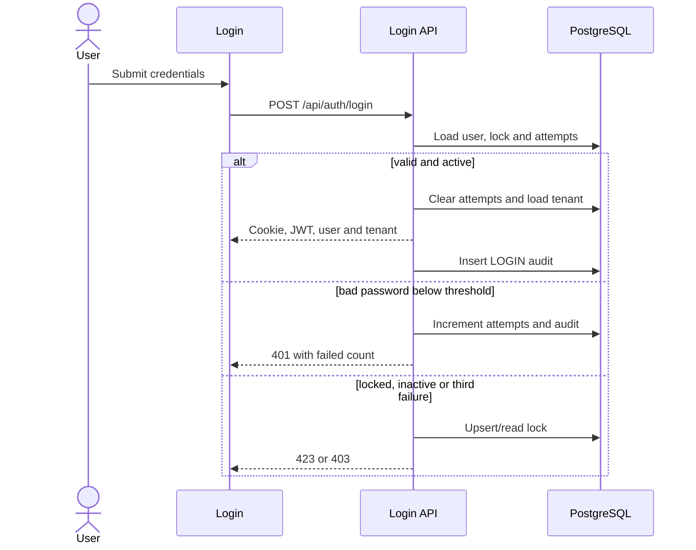
```mermaid
sequenceDiagram
  actor U as User
  participant F as Login
  participant A as Login API
  participant D as PostgreSQL
  U->>F: Submit credentials
  F->>A: POST /api/auth/login
  A->>D: Load user, lock and attempts
  alt valid and active
    A->>D: Clear attempts and load tenant
    A-->>F: Cookie, JWT, user and tenant
    A->>D: Insert LOGIN audit
  else bad password below threshold
    A->>D: Increment attempts and audit
    A-->>F: 401 with failed count
  else locked, inactive or third failure
    A->>D: Upsert/read lock
    A-->>F: 423 or 403
  end
```

### 2. Logout

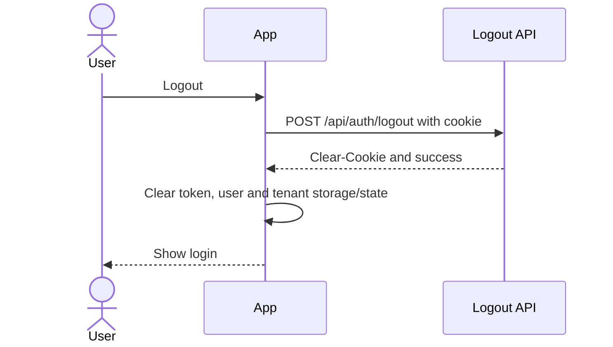
```mermaid
sequenceDiagram
  actor U as User
  participant F as App
  participant A as Logout API
  U->>F: Logout
  F->>A: POST /api/auth/logout with cookie
  A-->>F: Clear-Cookie and success
  F->>F: Clear token, user and tenant storage/state
  F-->>U: Show login
```

### 3. Forgot Password

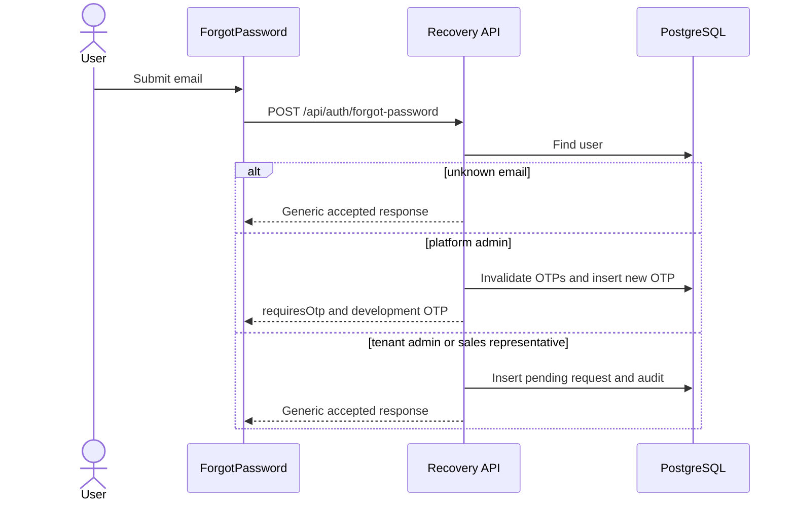
```mermaid
sequenceDiagram
  actor U as User
  participant F as ForgotPassword
  participant A as Recovery API
  participant D as PostgreSQL
  U->>F: Submit email
  F->>A: POST /api/auth/forgot-password
  A->>D: Find user
  alt unknown email
    A-->>F: Generic accepted response
  else platform admin
    A->>D: Invalidate OTPs and insert new OTP
    A-->>F: requiresOtp and development OTP
  else tenant admin or sales representative
    A->>D: Insert pending request and audit
    A-->>F: Generic accepted response
  end
```

### 4. Password Reset

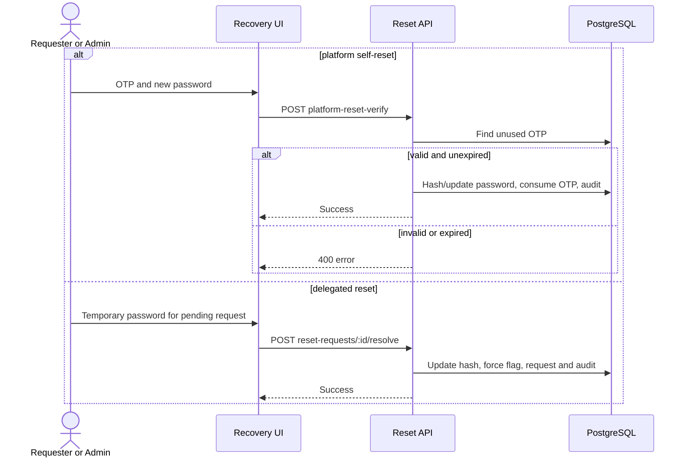
```mermaid
sequenceDiagram
  actor R as Requester or Admin
  participant F as Recovery UI
  participant A as Reset API
  participant D as PostgreSQL
  alt platform self-reset
    R->>F: OTP and new password
    F->>A: POST platform-reset-verify
    A->>D: Find unused OTP
    alt valid and unexpired
      A->>D: Hash/update password, consume OTP, audit
      A-->>F: Success
    else invalid or expired
      A-->>F: 400 error
    end
  else delegated reset
    R->>F: Temporary password for pending request
    F->>A: POST reset-requests/:id/resolve
    A->>D: Update hash, force flag, request and audit
    A-->>F: Success
  end
```

### 5. Change Password

```mermaid
sequenceDiagram
  actor U as User
  participant F as Profile or ForcePasswordChange
  participant G as JWT Guard
  participant A as User API
  participant D as PostgreSQL
  U->>F: Submit matching password fields
  F->>G: PUT /api/users/:id
  G->>A: Verified claims
  A->>A: Validate self/admin and password
  alt valid
    A->>D: Hash and update; clear force flag; audit
    A-->>F: Success
  else invalid or unauthorized
    A-->>F: 400 or 403
  end
```

### 6. User Registration

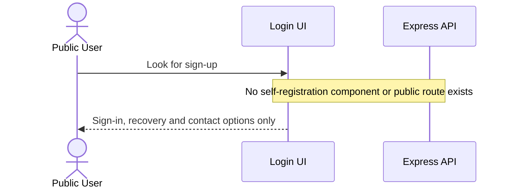
```mermaid
sequenceDiagram
  actor U as Public User
  participant F as Login UI
  participant A as Express API
  U->>F: Look for sign-up
  Note over F,A: No self-registration component or public route exists
  F-->>U: Sign-in, recovery and contact options only
```

### 7. User Creation

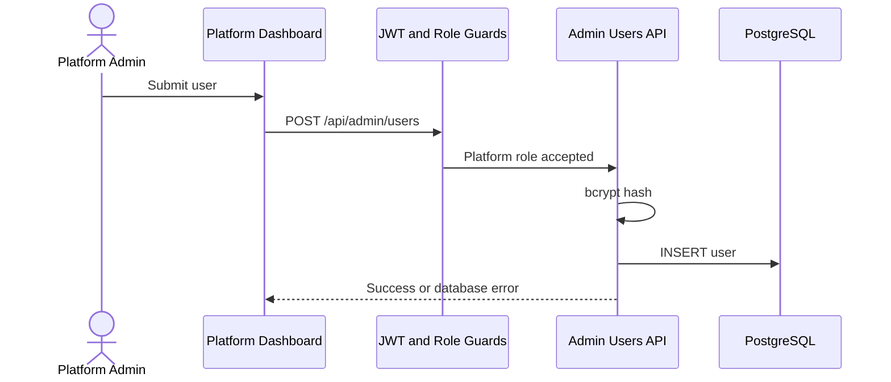
```mermaid
sequenceDiagram
  actor P as Platform Admin
  participant F as Platform Dashboard
  participant G as JWT and Role Guards
  participant A as Admin Users API
  participant D as PostgreSQL
  P->>F: Submit user
  F->>G: POST /api/admin/users
  G->>A: Platform role accepted
  A->>A: bcrypt hash
  A->>D: INSERT user
  A-->>F: Success or database error
```

### 8. Tenant Creation

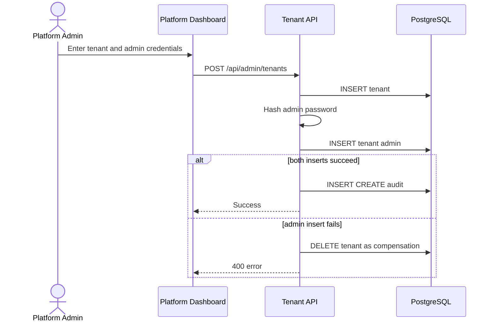
```mermaid
sequenceDiagram
  actor P as Platform Admin
  participant F as Platform Dashboard
  participant A as Tenant API
  participant D as PostgreSQL
  P->>F: Enter tenant and admin credentials
  F->>A: POST /api/admin/tenants
  A->>D: INSERT tenant
  A->>A: Hash admin password
  A->>D: INSERT tenant admin
  alt both inserts succeed
    A->>D: INSERT CREATE audit
    A-->>F: Success
  else admin insert fails
    A->>D: DELETE tenant as compensation
    A-->>F: 400 error
  end
```

### 9. Tenant Update

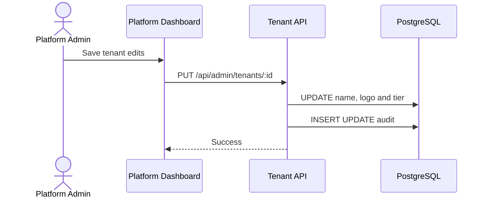
```mermaid
sequenceDiagram
  actor P as Platform Admin
  participant F as Platform Dashboard
  participant A as Tenant API
  participant D as PostgreSQL
  P->>F: Save tenant edits
  F->>A: PUT /api/admin/tenants/:id
  A->>D: UPDATE name, logo and tier
  A->>D: INSERT UPDATE audit
  A-->>F: Success
```

### 10. Tenant Delete

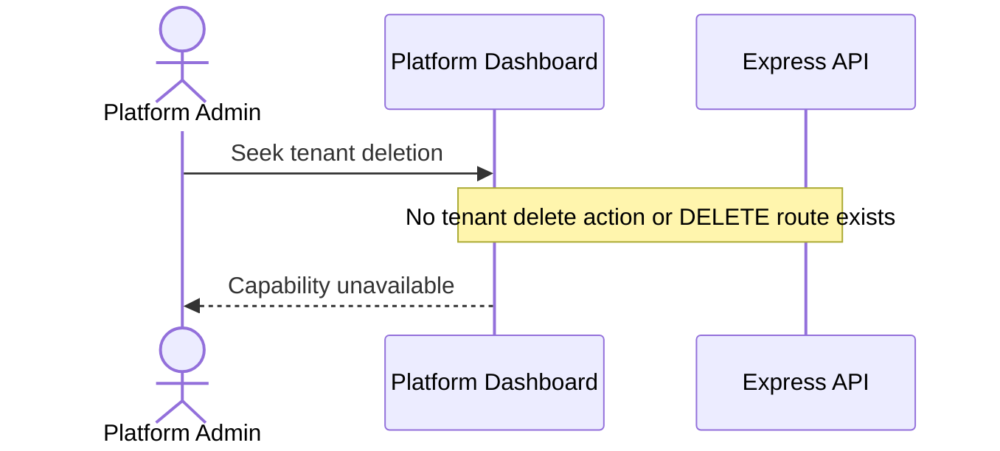
```mermaid
sequenceDiagram
  actor P as Platform Admin
  participant F as Platform Dashboard
  participant A as Express API
  P->>F: Seek tenant deletion
  Note over F,A: No tenant delete action or DELETE route exists
  F-->>P: Capability unavailable
```

### 11. Sales Representative Creation

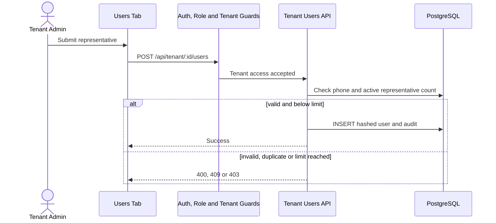
```mermaid
sequenceDiagram
  actor T as Tenant Admin
  participant F as Users Tab
  participant G as Auth, Role and Tenant Guards
  participant A as Tenant Users API
  participant D as PostgreSQL
  T->>F: Submit representative
  F->>G: POST /api/tenant/:id/users
  G->>A: Tenant access accepted
  A->>D: Check phone and active representative count
  alt valid and below limit
    A->>D: INSERT hashed user and audit
    A-->>F: Success
  else invalid, duplicate or limit reached
    A-->>F: 400, 409 or 403
  end
```

### 12. Sales Representative Update

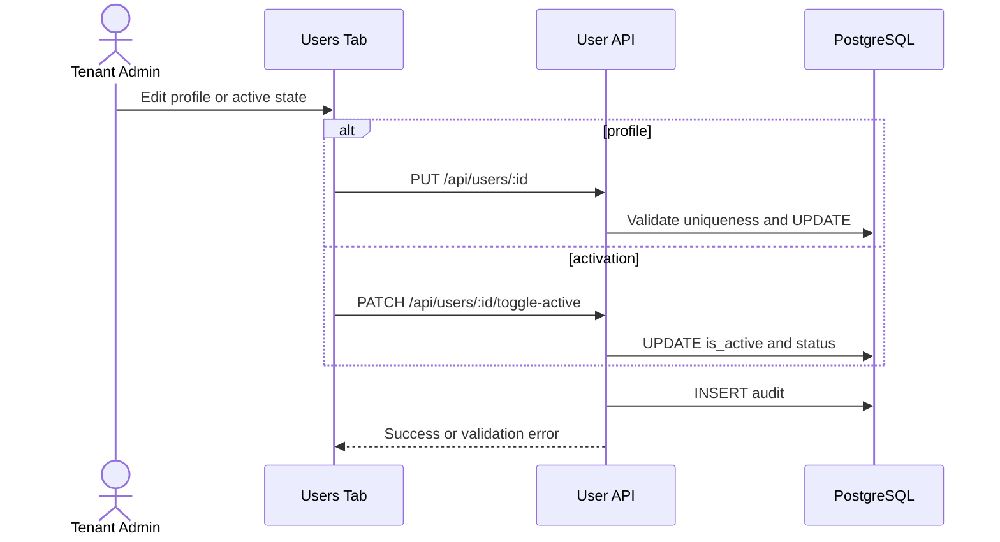
```mermaid
sequenceDiagram
  actor T as Tenant Admin
  participant F as Users Tab
  participant A as User API
  participant D as PostgreSQL
  T->>F: Edit profile or active state
  alt profile
    F->>A: PUT /api/users/:id
    A->>D: Validate uniqueness and UPDATE
  else activation
    F->>A: PATCH /api/users/:id/toggle-active
    A->>D: UPDATE is_active and status
  end
  A->>D: INSERT audit
  A-->>F: Success or validation error
```

### 13. Sales Representative Delete

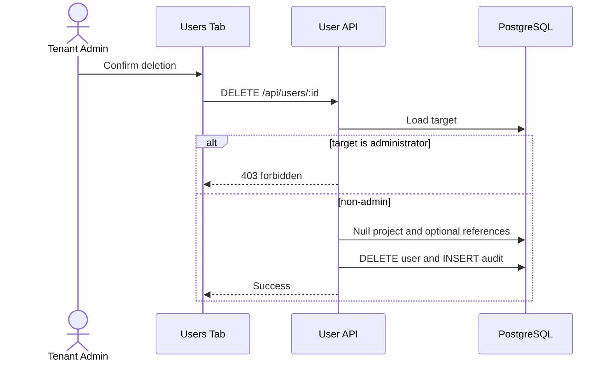
```mermaid
sequenceDiagram
  actor T as Tenant Admin
  participant F as Users Tab
  participant A as User API
  participant D as PostgreSQL
  T->>F: Confirm deletion
  F->>A: DELETE /api/users/:id
  A->>D: Load target
  alt target is administrator
    A-->>F: 403 forbidden
  else non-admin
    A->>D: Null project and optional references
    A->>D: DELETE user and INSERT audit
    A-->>F: Success
  end
```

### 14. Equipment CRUD

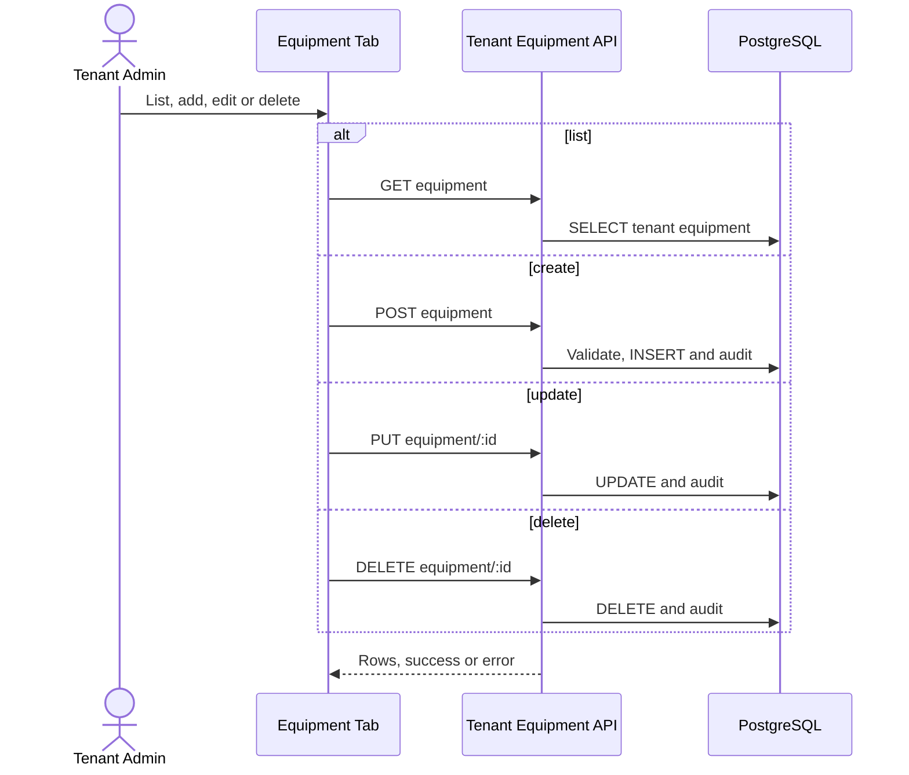
```mermaid
sequenceDiagram
  actor T as Tenant Admin
  participant F as Equipment Tab
  participant A as Tenant Equipment API
  participant D as PostgreSQL
  T->>F: List, add, edit or delete
  alt list
    F->>A: GET equipment
    A->>D: SELECT tenant equipment
  else create
    F->>A: POST equipment
    A->>D: Validate, INSERT and audit
  else update
    F->>A: PUT equipment/:id
    A->>D: UPDATE and audit
  else delete
    F->>A: DELETE equipment/:id
    A->>D: DELETE and audit
  end
  A-->>F: Rows, success or error
```

### 15. Equipment Search

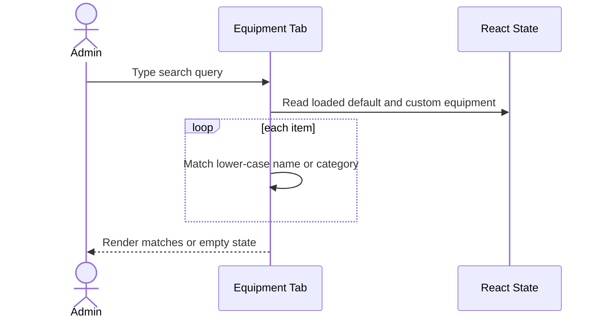
```mermaid
sequenceDiagram
  actor U as Admin
  participant F as Equipment Tab
  participant S as React State
  U->>F: Type search query
  F->>S: Read loaded default and custom equipment
  loop each item
    F->>F: Match lower-case name or category
  end
  F-->>U: Render matches or empty state
```

### 16. Equipment Filter

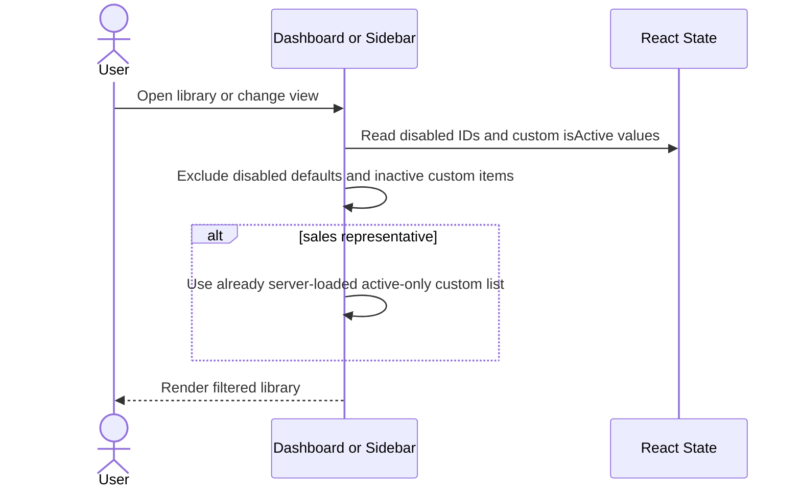
```mermaid
sequenceDiagram
  actor U as User
  participant F as Dashboard or Sidebar
  participant S as React State
  U->>F: Open library or change view
  F->>S: Read disabled IDs and custom isActive values
  F->>F: Exclude disabled defaults and inactive custom items
  alt sales representative
    F->>F: Use already server-loaded active-only custom list
  end
  F-->>U: Render filtered library
```

### 17. Upload GLB Model

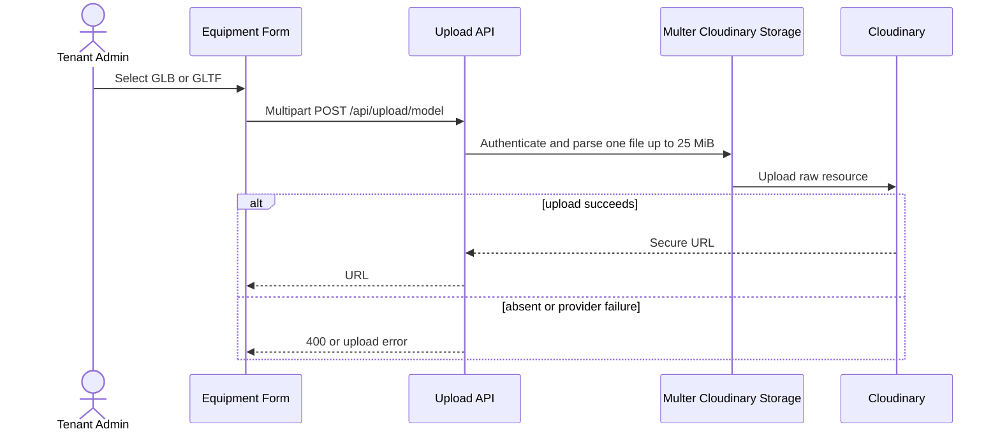
```mermaid
sequenceDiagram
  actor T as Tenant Admin
  participant F as Equipment Form
  participant A as Upload API
  participant M as Multer Cloudinary Storage
  participant C as Cloudinary
  T->>F: Select GLB or GLTF
  F->>A: Multipart POST /api/upload/model
  A->>M: Authenticate and parse one file up to 25 MiB
  M->>C: Upload raw resource
  alt upload succeeds
    C-->>A: Secure URL
    A-->>F: URL
  else absent or provider failure
    A-->>F: 400 or upload error
  end
```

### 18. Cloudinary Upload

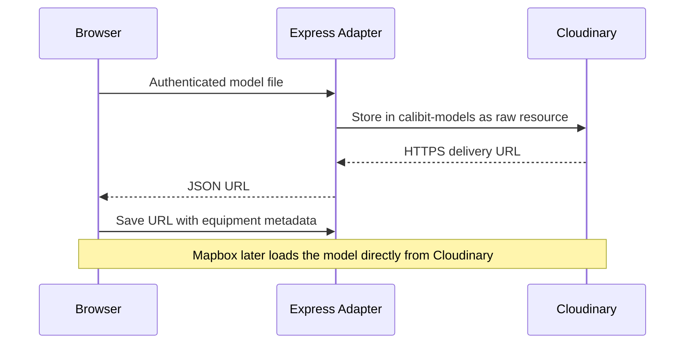
```mermaid
sequenceDiagram
  participant B as Browser
  participant E as Express Adapter
  participant C as Cloudinary
  B->>E: Authenticated model file
  E->>C: Store in calibit-models as raw resource
  C-->>E: HTTPS delivery URL
  E-->>B: JSON URL
  B->>E: Save URL with equipment metadata
  Note over B,C: Mapbox later loads the model directly from Cloudinary
```

### 19. Project Save

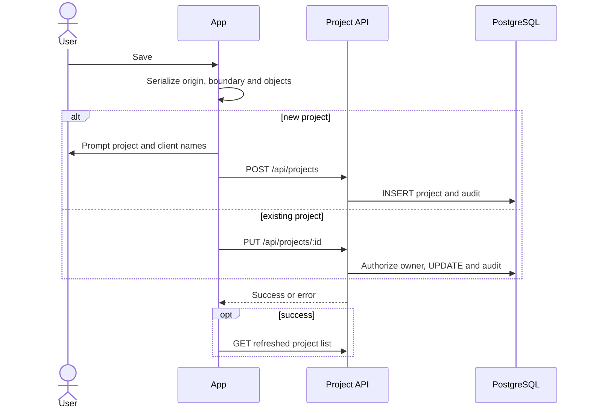
```mermaid
sequenceDiagram
  actor U as User
  participant F as App
  participant A as Project API
  participant D as PostgreSQL
  U->>F: Save
  F->>F: Serialize origin, boundary and objects
  alt new project
    F->>U: Prompt project and client names
    F->>A: POST /api/projects
    A->>D: INSERT project and audit
  else existing project
    F->>A: PUT /api/projects/:id
    A->>D: Authorize owner, UPDATE and audit
  end
  A-->>F: Success or error
  opt success
    F->>A: GET refreshed project list
  end
```

### 20. Project Load

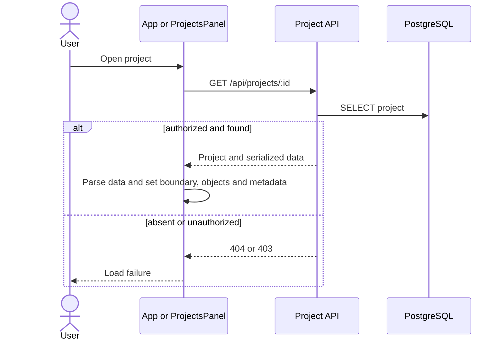
```mermaid
sequenceDiagram
  actor U as User
  participant F as App or ProjectsPanel
  participant A as Project API
  participant D as PostgreSQL
  U->>F: Open project
  F->>A: GET /api/projects/:id
  A->>D: SELECT project
  alt authorized and found
    A-->>F: Project and serialized data
    F->>F: Parse data and set boundary, objects and metadata
  else absent or unauthorized
    A-->>F: 404 or 403
    F-->>U: Load failure
  end
```

### 21. Project Delete

```mermaid
sequenceDiagram
  actor U as User
  participant F as ProjectsPanel
  participant A as Project API
  participant D as PostgreSQL
  U->>F: Confirm delete
  F->>A: DELETE /api/projects/:id
  A->>D: Load and authorize project
  alt authorized
    A->>D: DELETE project and INSERT audit
    A-->>F: Success
    F->>F: Remove local row and notify App
  else failure
    A-->>F: 403, 404 or 500
  end
```

### 22. Import Project

```mermaid
sequenceDiagram
  actor U as User
  participant F as Browser Importer
  participant P as Format Parser
  participant S as AppState
  U->>F: Choose JSON, pseudo-DWG, XLSX or exported PDF
  F->>P: Read file
  alt compatible embedded payload
    P-->>F: Parsed boundary and objects
    alt current design exists
      F->>U: Cancel, export first or replace
    end
    F->>S: Apply imported boundary and objects
  else corrupt or third-party format
    P-->>F: Parse/missing-data error
    F-->>U: Import failure
  end
```

### 23. Export PDF

```mermaid
sequenceDiagram
  actor U as User
  participant F as App Exporter
  participant M as Mapbox Static API
  participant C as Browser Canvas
  participant P as jsPDF
  U->>F: Export PDF
  F->>F: Build report data and map bounding box
  opt token and origin available
    F->>M: Request static map
    M-->>F: Image or error
  end
  F->>C: Draw boundary, pins and capture live map
  F->>P: Add metadata, table, images and embedded base64 JSON
  P-->>U: Download PDF
```

### 24. Export Excel

```mermaid
sequenceDiagram
  actor U as User
  participant F as App Exporter
  participant X as SheetJS
  U->>F: Export Excel
  F->>F: Build project information and equipment rows
  F->>F: Serialize and chunk raw project JSON
  F->>X: Create visible sheet and hidden _ProjectData sheet
  X-->>U: Download XLSX
```

### 25. Export DWG

```mermaid
sequenceDiagram
  actor U as User
  participant F as App Exporter
  participant B as Browser Blob API
  U->>F: Export DWG
  Note over F: No CAD or DWG encoder exists
  F->>F: JSON.stringify project data
  F->>B: application/json bytes with .dwg filename
  B-->>U: Download pseudo-DWG
```

### 26. APS Translation

```mermaid
sequenceDiagram
  actor U as User
  participant F as Application
  participant APS as Autodesk Platform Services
  U->>F: Seek model translation
  Note over F,APS: No APS dependency, credentials, upload, job, manifest or polling path exists
  F-->>U: Capability unavailable
```

### 27. Google Maps Search (Mapbox Substitution)

```mermaid
sequenceDiagram
  actor U as User
  participant F as LocationSearch
  participant M as Mapbox Geocoding
  participant A as App and MapPanel
  U->>F: Type location
  F->>F: Debounce query
  F->>M: GET geocoding suggestions, limit five
  alt success
    M-->>F: Features
    U->>F: Select suggestion
    F->>A: Target longitude and latitude
    A->>A: Fly map camera
  else token or network error
    F-->>U: Empty suggestion list
  end
  Note over F,M: Google Maps is not called
```

### 28. Draw Polygon

```mermaid
sequenceDiagram
  actor U as User
  participant F as MapPanel
  participant D as Mapbox Draw
  participant S as AppState
  U->>F: Start boundary drawing
  F->>D: changeMode draw_polygon
  U->>D: Place vertices and finish
  D->>F: draw.create or draw.update
  F->>F: Remove duplicate closing coordinate
  F->>S: setBoundary and first-point origin
  opt delete or clear
    D->>F: draw.delete
    F->>S: Empty boundary
  end
```

### 29. Calculate Area

```mermaid
sequenceDiagram
  actor U as User
  participant F as Configurator
  participant T as Turf
  U->>F: Define polygon
  Note over F,T: No area UI, handler or turf.area invocation exists
  F-->>U: Boundary is stored without an area result
```

### 30. Compliance Check

```mermaid
sequenceDiagram
  actor U as User
  participant F as CompliancePanel
  participant A as Compliance API
  participant G as Gemini
  U->>F: Run compliance check
  F->>F: Map objects to names, categories, positions and dimensions
  F->>A: POST /api/compliance/check
  A->>A: Authenticate and apply hourly AI limit
  A->>G: Prompt plus structured JSON schema
  alt valid provider response
    G-->>A: JSON report
    A-->>F: Score, checks, summary and recommendations
  else rate/provider/parse failure
    A-->>F: 429 or 500 error
  end
```

### 31. AI Recommendation

```mermaid
sequenceDiagram
  participant F as CompliancePanel
  participant A as Compliance API
  participant G as Gemini
  F->>A: Site configuration
  A->>G: Ask for schema-bound assessment
  G-->>A: recommendations array with checks
  A-->>F: ComplianceReport
  F->>F: Render actionable recommendation list
  Note over F: Recommendations are transient and not saved
```

### 32. Activity Logging

```mermaid
sequenceDiagram
  participant H as Business Route Handler
  participant L as logActivity
  participant D as PostgreSQL
  H->>D: Perform business mutation
  H->>L: Actor, tenant, action, entity and details
  L->>D: INSERT activity_logs
  alt audit insert succeeds
    D-->>L: Complete
  else audit insert fails
    L->>L: Log server error and swallow
  end
  H-->>H: Business response is independent of audit result
```

### 33. Dashboard Load

```mermaid
sequenceDiagram
  actor T as Tenant Admin
  participant F as AdminDashboard
  participant A as Tenant APIs
  participant D as PostgreSQL
  T->>F: Enter dashboard after login
  par tenant users and reset requests
    F->>A: GET users and pending resets
  and equipment, defaults and stats
    F->>A: GET equipment, disabled defaults and stats
  and projects and logs
    F->>A: GET active projects, project stats and logs
  end
  A->>D: Execute scoped queries
  D-->>A: Independent result sets
  A-->>F: JSON responses
  F-->>T: Render available dashboard panels
```

### 34. Dashboard Refresh

```mermaid
sequenceDiagram
  actor T as Admin
  participant F as Dashboard
  participant A as APIs
  T->>F: Complete a mutation or revisit a panel
  F->>A: Re-fetch affected list/stat endpoints
  alt request succeeds
    A-->>F: Latest independent dataset
    F->>F: Replace panel state
  else request fails
    A-->>F: Error response
    Note over F: No atomic full-dashboard snapshot or universal refresh exists
  end
```

### 35. User Profile Update

```mermaid
sequenceDiagram
  actor U as User
  participant F as Profile Form
  participant A as User API
  participant D as PostgreSQL
  U->>F: Submit name, phone and optional password
  F->>A: PUT /api/users/:id
  A->>A: Check self/admin, phone and password
  alt valid
    A->>D: UPDATE user and INSERT audit
    A-->>F: Success
    F->>F: Update cached identity
  else duplicate, invalid or forbidden
    A-->>F: 400, 409 or 403
  end
```

### 36. Unlock User

```mermaid
sequenceDiagram
  actor A1 as Authorized Admin
  participant F as LockedAccountsPanel
  participant A as Lockout API
  participant D as PostgreSQL
  F->>A: GET /api/lockable-accounts
  A->>D: Query locks allowed for caller role and tenant
  D-->>F: Eligible locks
  A1->>F: Confirm unlock and optional reason
  F->>A: POST /api/locked-accounts/:userId/unlock
  alt hierarchy and tenant valid
    A->>D: DELETE lock and INSERT audit
    A-->>F: Success
  else invalid scope or missing lock
    A-->>F: 403 or 404
  end
```

### 37. Lock User

```mermaid
sequenceDiagram
  actor U as Known User
  participant A as Login API
  participant D as PostgreSQL
  U->>A: Submit wrong password
  A->>D: Read and increment failed count
  alt count below three
    A->>D: Upsert login_attempts and audit
    A-->>U: 401 with count
  else third failure
    A->>D: Upsert locked_accounts
    A->>D: Delete attempts and insert lock audit
    A-->>U: 423 locked
  end
  Note over A,D: No manual administrative lock route exists
```

### 38. Failed Login Attempts

```mermaid
sequenceDiagram
  participant A as Login API
  participant D as PostgreSQL
  A->>D: SELECT login_attempts by known user ID
  A->>A: failedCount equals prior count plus one
  alt one or two
    A->>D: INSERT or UPDATE attempts with timestamp
    A-->>A: Return count to login response
  else three
    A->>D: Create lock and clear attempts
    A-->>A: Return accountLocked
  end
```

### 39. JWT Authentication

```mermaid
sequenceDiagram
  participant B as Browser authFetch
  participant G as authenticate Middleware
  participant J as jsonwebtoken
  participant H as Protected Handler
  B->>G: Request with HttpOnly cookie and optional bearer
  G->>G: Prefer cookie token
  alt token present and valid
    G->>J: verify signature and expiry
    J-->>G: userId, role, tenantId and userName
    G->>H: next with request.user
  else missing, invalid or expired
    G-->>B: 401 token error
    B->>B: Logout, clear storage and redirect
  end
```

### 40. Role Authorization

```mermaid
sequenceDiagram
  participant G as authenticate
  participant R as requireRole
  participant H as Route Handler
  G->>R: Verified request claims
  R->>R: Compare claim role with allowed roles
  alt allowed
    R->>H: next
  else denied
    R-->>R: 403 Insufficient permissions
  end
```

### 41. Admin Dashboard Loading

```mermaid
sequenceDiagram
  actor P as Platform Admin
  participant F as PlatformAdminDashboard
  participant A as Platform APIs
  participant D as PostgreSQL
  P->>F: Enter platform workspace
  par overview
    F->>A: GET /api/admin/stats
  and tenants and users
    F->>A: GET /api/admin/tenants and /api/admin/users
  and governance data
    F->>A: GET logs and tenant-admin reset requests
  end
  A->>D: Execute platform-scoped queries
  D-->>A: Results
  A-->>F: Independent JSON responses
  F-->>P: Render successful datasets
```

### 42. Audit Logs

```mermaid
sequenceDiagram
  actor A1 as Admin
  participant F as Logs Tab
  participant A as Logs API
  participant D as PostgreSQL
  A1->>F: Open logs
  alt tenant admin
    F->>A: GET /api/tenant/:id/logs with limit and offset
    A->>D: SELECT tenant_id rows ordered newest first
  else platform admin
    F->>A: GET /api/admin/logs
    A->>D: SELECT tenant_id IS NULL rows
  end
  A-->>F: Log rows
  F->>F: Apply entity and date filters client-side
```

### 43. API Error Flow

```mermaid
sequenceDiagram
  participant F as React Component
  participant C as authFetch or direct fetch
  participant G as Express Guards
  participant H as Route Handler
  F->>C: API request
  C->>G: HTTP request
  alt auth or role failure
    G-->>C: 401 or 403 JSON
    opt recognized token message
      C->>C: Logout and redirect
    end
  else validation or domain failure
    G->>H: next
    H-->>C: 400, 404, 409, 423 or 429
  else internal/provider failure
    H-->>C: 500 where locally caught
  end
  C-->>F: Response
  Note over G,H: No centralized terminal error middleware is defined
```

### 44. Database Error Flow

```mermaid
sequenceDiagram
  participant S as Server Startup or Handler
  participant D as PostgreSQL Pool
  alt startup
    S->>D: SELECT 1 and execute schema statements
    alt failure
      D-->>S: Error
      S->>S: Log and exit process with code 1
    end
  else request
    S->>D: Parameterized query
    alt locally caught
      D-->>S: Error
      S-->>S: safeError or fixed 4xx/5xx response
    else uncaught async error
      D-->>S: Rejection with no centralized handler
    end
  end
```

### 45. Session Expiry

```mermaid
sequenceDiagram
  actor U as User
  participant F as React UI
  participant C as authFetch
  participant G as JWT Middleware
  U->>F: Trigger protected request after eight-hour expiry
  F->>C: API request
  C->>G: Expired JWT cookie/bearer
  G-->>C: 401 Invalid or expired token
  C->>C: POST logout, clear local storage
  C->>F: Navigate to root
  F-->>U: Login page
```

### 46. Token Refresh

```mermaid
sequenceDiagram
  actor U as User
  participant F as Browser
  participant A as Express API
  U->>F: Continue after token expiry
  Note over F,A: No refresh token, refresh endpoint, rotation or token store exists
  F-->>U: Reauthentication is required after reactive logout
```

### 47. Tenant Isolation Validation

```mermaid
sequenceDiagram
  participant B as Browser
  participant J as JWT Guard
  participant T as Tenant Guard or Ownership Check
  participant H as Handler
  participant D as PostgreSQL
  B->>J: Protected tenant or project request
  J->>T: Claims plus requested identifier
  alt platform admin
    T->>H: Bypass tenant equality
  else JWT tenant equals requested or loaded tenant
    T->>H: Continue
  else mismatch
    T-->>B: 403 Access denied
  end
  H->>D: Scoped query
  D-->>H: Rows
  Note over T,H: Some write bodies still accept caller-provided tenant/user IDs and require hardening
```

### 48. Equipment Library Loading

```mermaid
sequenceDiagram
  participant F as App
  participant A as Tenant Equipment APIs
  participant D as PostgreSQL
  participant S as Sidebar
  F->>A: GET disabled defaults and custom equipment
  A->>D: SELECT tenant rows
  D-->>A: IDs and equipment records
  A-->>F: JSON
  F->>F: Map snake_case fields and filter inactive for sales role
  F->>S: DEFAULT_LIBRARY minus disabled plus active custom library
  S-->>S: Render selectable equipment
```

### 49. Thumbnail Generation

```mermaid
sequenceDiagram
  actor T as Tenant Admin
  participant F as Equipment Form
  participant R as FileReader
  participant C as Browser Canvas
  T->>F: Select equipment image
  F->>R: Read image file
  R-->>F: Data URL
  F->>C: Resize and JPEG-compress preview
  alt successful image
    C-->>F: Compressed data URL
  else missing image or processing failure
    F->>F: Use generated SVG/data-URI fallback
  end
  Note over F,C: No server-side GLB thumbnail renderer exists
```

### 50. Email Notification

```mermaid
sequenceDiagram
  actor U as User
  participant F as Recovery or Admin UI
  participant A as Express API
  participant E as Email Provider
  U->>F: Request recovery or credentials
  F->>A: Recovery or tenant creation request
  Note over A,E: No mail package, provider adapter, template, queue or send call exists
  A-->>F: OTP in development response or copyable credentials
  F-->>U: Manual on-screen handoff only
```
